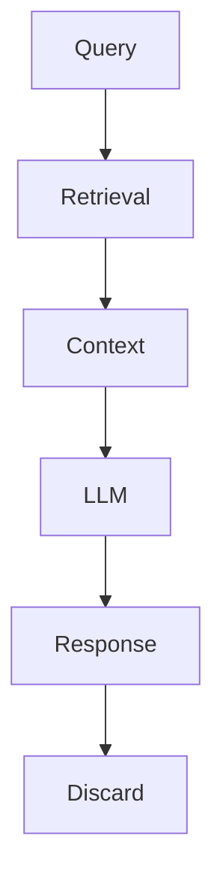
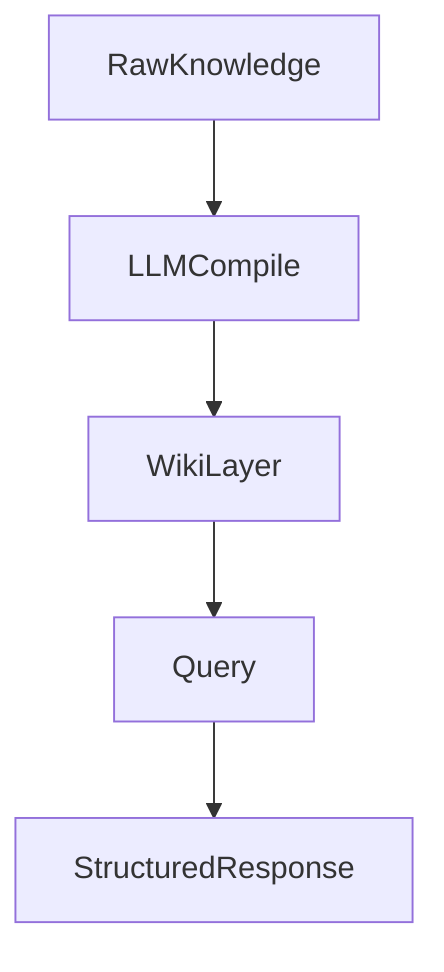

# RAG vs LLM Wiki

> [!summary] 对比概述
RAG 是"用完即弃"的实时检索模式，每次查询重新从原始文档中提取信息；LLM Wiki 是"知识编译"模式，将原始知识预先转化为结构化 Wiki，实现知识的持续累积与高效复用。

## 核心维度对比

| 维度 | RAG | LLM Wiki |
|-----|-----|----------|
| 知识处理 | 实时检索原始文档 | 预先编译结构化知识 |
| 知识累积 | 无累积，每次重新检索 | 持续沉淀到 Wiki 层 |
| 查询效率 | 每次重新检索+生成 | 直接查询已编译知识 |
| 维护成本 | 低（原始文档不变） | 需要持续编译维护 |
| 知识质量 | 原始文档片段，可能碎片化 | 经过编译提炼，结构化 |
| 上下文管理 | 依赖检索切片质量 | Wiki 层已优化上下文 |
| 适用场景 | 临时查询、动态数据源 | 长期知识库、高频复用 |
| 可扩展性 | 检索范围受 Token 限制 | Wiki 层可无限累积 |
| 一致性 | 每次结果可能不同 | 编译后保持稳定 |

## 详细分析

### 1. 知识处理范式

**RAG (Retrieval-Augmented Generation)**

RAG 采用"即时检索"范式：
- 用户发起查询时，系统从原始文档库中检索相关片段
- 将检索到的片段作为上下文注入 LLM
- LLM 基于临时上下文生成回答
- 查询结束后，检索结果不保留



**LLM Wiki (Knowledge Compilation)**

LLM Wiki 采用"预先编译"范式：
- 原始知识源（文档、对话、经验）预先经过 LLM 编译
- 编译产物沉淀为结构化 Wiki（Entities、Comparisons、Guides）
- 用户查询直接访问已编译的 Wiki 层
- 新知识持续编译并入 Wiki，形成知识累积



### 2. 知识累积机制

| 特性 | RAG | LLM Wiki |
|-----|-----|----------|
| 知识生命周期 | 查询即弃，无留存 | 持久化 Wiki 层 |
| 学习曲线 | 每次查询同等成本 | 首次编译成本高，后续成本低 |
| 知识演进 | 原始文档更新即可 | 需重新编译受影响部分 |
| 知识复用 | 每次重新检索 | Wiki 可被多次引用 |

> [!tip] 核心差异
> RAG = "知识即用即弃" —— 每次查询都是从零开始
> LLM Wiki = "知识越用越丰富" —— 每次查询都在复用已沉淀的知识

### 3. 查询效率分析

**RAG 效率瓶颈**：
- 每次查询需执行检索（向量搜索/关键词匹配）
- 检索切片可能不完整或冗余
- LLM 需重新理解原始文档片段
- 高频查询场景成本累积

**LLM Wiki 效率优势**：
- Wiki 层已是"消化后"的知识，语义清晰
- 避免重复检索和重复理解
- Entity/Comparison/Guide 结构化呈现
- 适合高频查询和知识复用场景

### 4. 上下文工程关联

参见 [[Context-Engineering]]

| 维度 | RAG | LLM Wiki |
|-----|-----|----------|
| 上下文来源 | 检索切片（临时） | Wiki 层（持久） |
| 上下文优化 | 依赖切片算法 | 编译时已优化 |
| 上下文冲突 | 切片间可能矛盾 | Wiki 已解决矛盾 |
| 上下文边界 | Token 限制 | Wiki 层可分层管理 |

### 5. 多层记忆架构关联

参见 [[Multi-Layer-Memory]]

LLM Wiki 本质上是多层记忆架构的实现：
- **短期记忆**：当前对话上下文
- **工作记忆**：检索到的临时知识（RAG 层）
- **长期记忆**：编译后的 Wiki 层（持久化）

RAG 仅覆盖短期+工作记忆，LLM Wiki 构建了完整的长期记忆层。

## 架构对比

### RAG 架构

```
+------------------+
|   User Query     |
+------------------+
         |
         v
+------------------+
| Vector Search    |  <-- 实时检索
+------------------+
         |
         v
+------------------+
| Context Assembly |  <-- 拼接切片
+------------------+
         |
         v
+------------------+
|   LLM Generate   |  <-- 生成回答
+------------------+
         |
         v
+------------------+
|   Response       |
+------------------+
         |
         v
      [Discard]     <-- 不保留
```

### LLM Wiki 架构

```
+------------------+     +------------------+
|  Raw Knowledge   | --> |   LLM Compile    |
+------------------+     +------------------+
                                |
                                v
                         +------------------+
                         |   Wiki Layer     |  <-- 持久化
                         |  (Entities)      |
                         |  (Comparisons)   |
                         |  (Guides)        |
                         +------------------+
                                |
         +----------------------+
         |
         v
+------------------+
|   User Query     |
+------------------+
         |
         v
+------------------+
|   Wiki Query     |  <-- 直接查询
+------------------+
         |
         v
+------------------+
| Structured       |
|   Response       |
+------------------+
```

## 适用场景指南

### 选择 RAG 的场景

- 数据源频繁变化（新闻、实时数据）
- 临时性查询，无需知识留存
- 检索范围小，Token 预算充足
- 对一致性要求不高

### 选择 LLM Wiki 的场景

- 长期知识库建设
- 高频查询，需要知识复用
- 知识之间存在关联，需要系统性组织
- 对知识一致性和结构化有要求
- 团队协作，知识需要共享沉淀

## 混合架构

实践中可采用混合模式：
- RAG 处理动态/临时数据
- LLM Wiki 管理核心/长期知识
- 检索结果可选择性编译入 Wiki

```
+------------------+     +------------------+
| Dynamic Source   | --> |      RAG         |
+------------------+     +------------------+
                                |
                                v
                         [Query Response]
                                |
                                v
                         +------------------+
                         | Selective        |  <-- 有价值则编译
                         |   Compile        |
                         +------------------+
                                |
                                v
                         +------------------+
                         |   Wiki Layer     |
                         +------------------+
                                |
         +----------------------+--------+
         |                               |
+------------------+             +------------------+
| Static Source    |             |   Wiki Query     |
+------------------+             +------------------+
         |                               |
         v                               v
+------------------+             +------------------+
| Pre-compile      |             |   Response       |
+------------------+             +------------------+
```

## Karpathy 的原创论述

> [!quote] Andrej Karpathy, LLM Wiki (2026)
> "Most people's experience with LLMs and documents looks like RAG: you upload a collection of files, the LLM retrieves relevant chunks at query time, and generates an answer. This works, but the LLM is rediscovering knowledge from scratch on every question. There's no accumulation."
>
> "The idea here is different. Instead of just retrieving from raw documents at query time, the LLM **incrementally builds and maintains a persistent wiki** — a structured, interlinked collection of markdown files that sits between you and the raw sources."

### 核心差异提炼

> [!important] Karpathy 的关键洞察
> **The wiki is a persistent, compounding artifact.** The cross-references are already there. The contradictions have already been flagged. The synthesis already reflects everything you've read.

---

## 与 Memex 的思想关联

参见 [[Memex]]

Vannevar Bush 1945 年提出 Memex 概念，Karpathy 明确指出 LLM Wiki 的思想渊源：

> "The idea is related in spirit to Vannevar Bush's Memex (1945) — a personal, curated knowledge store with associative trails between documents. The part he couldn't solve was who does the maintenance. **The LLM handles that.**"

| Memex 挑战 | LLM Wiki 解决方案 |
|-----------|------------------|
| 路径创建需要人类劳动 | LLM 自动创建 wikilinks |
| 维护负担导致 abandon | LLM 不知疲倦地维护 |
| 矛盾检测需要人工 | 编译时自动标记矛盾 |

---

## 相关概念

- [[Context-Engineering]] — 上下文管理工程化
- [[Multi-Layer-Memory]] — 多层记忆架构
- [[Knowledge-Compilation]] — 知识编译操作
- [[Andrej-Karpathy]] — LLM Wiki 概念提出者

## GBrain 的混合架构方案

参见 [[GBrain]]

GBrain 在 RAG 和 LLM Wiki 之间找到了第三条路——混合检索架构（向量粗筛 + 文件精读）：

- **向量粗筛**：利用向量检索快速从海量文件中筛选出最相关的候选集（类似 RAG 的检索能力）
- **文件精读**：将筛选后的完整文件内容加载进 Context，由大模型深度阅读（保留 LLM Wiki 的语义完整性）
- **分层喂给（Layered Feeding）**：先提供"编译真相"（核心结论），再补充"时间线证据"（历史记录和原始来源）
- **图谱加权**：通过 back-link boost 提升连接良好实体的搜索排名——P@5 从 17.7% 提升到 49.1%（+31.4pp）

这种"向量粗筛 + 文件精读"的折衷方案，既避免了纯 RAG 的语义丢失和能力断档，也克服了纯 LLM Wiki 文件遍历的效率低下。知识本体仍存储在 Markdown 文件中，向量索引仅用于检索加速。

### GBrain vs RAG vs LLM Wiki

| 维度 | RAG | LLM Wiki | GBrain |
|-----|-----|----------|--------|
| 检索方式 | 纯向量/关键词实时检索 | index.md + grep 文本匹配 | 向量粗筛 + 文件精读 |
| 知识存储 | 原始文档库 | Markdown Wiki | Markdown Wiki + 向量索引 |
| 规模上限 | TB 级（向量数据库） | 数百～低千页面 | 中大规模（有向量加速） |
| 语义完整性 | 低（chunk 碎片化） | 高（完整文件阅读） | 高（完整文件阅读） |
| 检索精度 | 中（依赖向量质量） | 低（grep 简单匹配） | 高（向量 + 图谱加权） |

---

*本对比页面基于 Andrej Karpathy 的 LLM Wiki 设计文档创建，由 LLM Wiki 编译流程生成。2026-05-13 更新：加入 GBrain 混合架构对比。*