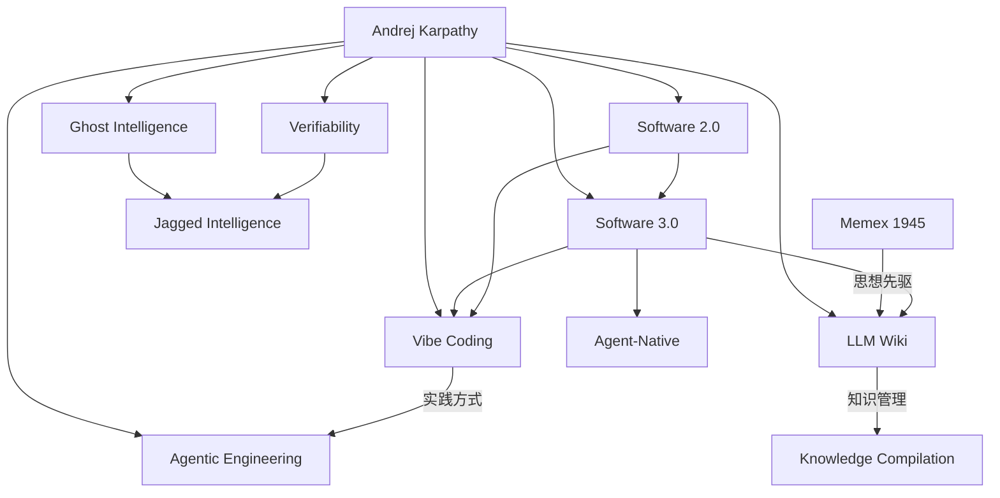

# Karpathy AI 思想体系

> **核心洞察**：从 Software 2.0 到 AI Psychosis，Karpathy 系统性地定义了 AI 时代的编程范式、能力鸿沟和知识管理范式。

---

## 思想演进路径

### 概念线

```
Software 2.0 (2017)
    ↓ 神经网络作为程序
Software 3.0 (2026)
    ↓ LLM 作为可提示的计算机
Vibe Coding (2025)
    ↓ 普及化、原型化实践
Agentic Engineering (2026)
    ↓ 生产级工程纪律
LLM Wiki (2026)
    ↓ Software 3.0 在知识管理中的应用
```

### 职业实践线

```
Stanford / CS231n (2011-2015)
    ↓
OpenAI founding team (2015-2017)
    ↓
Tesla Autopilot AI (2017-2022)
    ↓
OpenAI return (2023-2024)
    ↓
Eureka Labs (2024)
    ↓
Anthropic pre-training team (2026-)
```

---

## 核心概念矩阵

| 概念 | 提出时间 | 核心定义 | 与其他概念的关系 |
|-----|---------|---------|-----------------|
| **[[Software-2.0]]** | 2017 | 程序员写目标，神经网络编程 | 基础范式，定义 AI 编程时代 |
| **[[Vibe-Coding]]** | 2025 | 忘记代码存在，氛围驱动编程 | Software 3.0 的低门槛、原型化实践 |
| **[[Software-3.0]]** | 2026 | 上下文窗口是内存，提示词是程序语言，LLM 是解释器 | 将 LLM 从工具提升为新型计算机 |
| **[[Agentic-Engineering]]** | 2026 | 在不牺牲专业质量的前提下协调 coding agents | Vibe Coding 的生产级约束形态 |
| **[[Verifiability]]** | 2026 | 输出能否被自动验证决定 LLM 自动化速度 | 解释模型能力为何不均匀 |
| **[[Jagged-Intelligence]]** | 2026 | LLM 在不同任务上的能力呈锯齿状分布 | Verifiability 与训练投入共同造成 |
| **[[Ghost-Intelligence]]** | 2026 | LLM 是统计和 RL 塑造的幽灵，不是动物智能 | 校准对 LLM 动机、意识和可靠性的预期 |
| **[[Agent-Native]]** | 2026 | 为 agent 而非人类重写文档、基础设施和流程 | Software 3.0 的基础设施要求 |
| **[[LLM-Wiki]]** | 2026 | LLM 维护的持久知识库 | Software 3.0 的知识管理应用 |
| **[[Memex]]** | 1945 (引用) | 个人知识存储 + 关联路径 | LLM Wiki 的思想先驱 |
| **[[Shortification-of-Learning]]** | 2024 | 学习被压缩成顺滑短内容消费，削弱主动处理 | 解释为什么 raw 剪藏必须进入主动编译 |
| **[[AI-Capability-Gap]]** | 2026 | 不同用户群体因 AI 能力体验差异形成平行认知现实 | 编程 vs 日常使用 |
| **[[AI-Psychosis]]** | 2026 | 专业技术用户对 agentic AI 编程能力的极度震撼 | AI-Capability-Gap 的高端端 |
| **[[Slopocalypse]]** | 2026 | AI 生成内容和代码泛滥，筛选与信任成为瓶颈 | Vibe Coding 与 Agentic Engineering 的质量分界 |

---

## Software 2.0：范式转变

### 核心论点

> "The 'program' is the weights of the neural network... the 'compiler' is the optimizer... the 'source code' is the dataset."

### 转变的本质

|维度 | Software 1.0 | Software 2.0 |
|-----|--------------|--------------|
| **程序员工作** | 写代码逻辑 | 写目标和数据 |
| **程序来源** | 人类编写 | 神经网络学习 |
| **可读性** | 可读源代码 | 黑盒权重 |
| **调试方式** | 断点调试 | 数据清洗 |
| **版本控制** | Git | Checkpoint |

### 影响

Software 2.0 定义了：
- 深度学习时代的编程范式
- Tesla Autopilot 等神经网络系统的基础理念；ChatGPT 则更接近 Software 3.0 的可提示计算机
- 程序员角色的转变方向

---

## Vibe Coding：实践方式

### 定义

> "I just see things, say things, run things, and copy paste things, and it mostly works."

### 特征

- **忘记代码存在** — 不关心实现细节
- **原型质量** — 快速产出，不追求生产级
- **未经审查** — 直接使用 AI 输出
- **氛围驱动** — 凭直觉迭代

### 与 Agentic Engineering 的对比

参见 [[Agentic-Engineering]]

| 维度 | Vibe Coding | Agentic Engineering |
|------|-------------|---------------------|
| **代码质量** | 原型级 | 生产级 |
| **审查程度** | 无 | 深度审查 |
| **验证方式** | 凭感觉 | 自动测试 |
| **心态** | "忘记代码" | 验证和迭代 |

---

## LLM Wiki：知识管理范式

### 核心差异：RAG vs Wiki

参见 [[RAG-vs-LLM-Wiki]]

| 维度 | RAG | LLM Wiki |
|-----|-----|----------|
| 知识处理 | 实时检索 | 预先编译 |
| 知识累积 | 无 | 持久沉淀 |
| 维护者 | 人类（易厌倦） | LLM（不知疲倦） |

### Shortification：为什么剪藏不是学习

Karpathy 2024 年关于学习短视频化的判断给 LLM Wiki 补了学习观：真正学习需要处理、笔记、复述、重读和认知负荷，顺滑观看容易制造“我懂了”的错觉。

迁移到知识库就是：raw 入库不等于理解，source-summary、质疑、对标、entity 和 topic 才是学习动作。LLM Wiki 的价值不在于保存更多资料，而在于把资料编译成之后能复用的结构。

### 三层架构

```
Raw Sources (不可变)
    ↓ [[Knowledge-Compilation]]
Wiki (LLM 维护)
    ↓
Schema (人类 + LLM 共进化)
```

### 关键比喻

> [!quote] Karpathy 的精妙比喻
> "Obsidian is the IDE; the LLM is the programmer; the wiki is the codebase."

这揭示了：
- **Obsidian** — 存储设备（Memex 实现）
- **LLM** — 维护者（解决 Bush 的难题）
- **Wiki** — 知识代码库（associative trails）

---

## Memex：思想渊源

参见 [[Memex]]

Karpathy 明确指出 LLM Wiki 与 Memex 的关系：

> "The idea is related in spirit to Vannevar Bush's Memex (1945) — a personal, curated knowledge store with associative trails between documents. The part he couldn't solve was who does the maintenance. **The LLM handles that.**"

### 历史对话

| 问题 | Memex (1945) | LLM Wiki (2026) |
|-----|--------------|-----------------|
| 如何存储个人知识？ | 机械设备 | Obsidian vault |
| 如何创建关联？ | 人工路径 | 自动 wikilinks |
| 谁来维护？ | ❌ 未解决 | ✅ LLM |

---

## Claude Coding Notes：生成能力之后的质量约束

[[20260127-claude-coding-notes]] 把 Karpathy 的思想从范式命名推进到日常工程经验：coding agents 已经让工作流发生相变，但它们的错误也从语法层转移到概念层。

这篇 note 中的两个概念尤其重要：

- [[Agent-Tenacity]]：Agent 不疲劳、不气馁，可以长时间循环尝试直到达成目标。这解释了为什么 LLM coding 给人"能力跃迁"的体感。
- [[Slopocalypse]]：当这种持续生成能力扩散到 GitHub、Substack、arXiv 和社交媒体，质量瓶颈就从生成转移到筛选、审查和信任排序。

二者构成一组张力：tenacity 让 agent 能做更多事，slopocalypse 提醒我们更多产出并不自动等于更好产出。因此 Karpathy 思想体系内部并不是单纯鼓励更高自动化，而是在逼近 [[Agentic-Engineering]]：让 agent 负责生成和试错，让人类和系统负责验证、筛选、抽象和责任承担。

## 在本知识库中的体现

### 相关 Entities

- [[Software-2.0]] — 编程范式定义
- [[Software-3.0]] — LLM 作为新计算机
- [[Vibe-Coding]] — 实践方式描述
- [[Agentic-Engineering]] — 生产级 agent 编程纪律
- [[Verifiability]] — 解释能力跃迁的训练维度
- [[Jagged-Intelligence]] — LLM 能力分布形态
- [[Ghost-Intelligence]] — LLM 本体隐喻
- [[Agent-Native]] — agent 时代的基础设施范式
- [[Knowledge-Compilation]] — 编译操作定义
- [[Memex]] — 思想先驱
- [[Slopocalypse]] — 生成能力扩张后的质量与信任问题
- [[Agent-Tenacity]] — Agent 持续试错带来的工作扩张能力

### 相关 Comparisons

- [[RAG-vs-LLM-Wiki]] — 知识管理范式对比

### Raw Sources

- [[20260127-claude-coding-notes]] — Claude coding 相变、agent 韧性与 Slopocalypse 预警
- [[20260413-llm-wiki]] — LLM Wiki 设计文档（原始出处）
- [[一篇文章卖了20万，开源CC+Obsidian打造的LLM Wiki 内容创作3.0系统]] — 饼干哥哥的实战升级方案

---

## 内容创作3.0：从 Runtime RAG 到 Compile-time Wiki

> 饼干哥哥基于 Karpathy 方案的实战升级，将知识管理系统从"2.0 自动化创作"升级为"3.0 知识编译"

### 2.0 vs 3.0 的本质区别

| 维度 | 2.0 Runtime RAG | 3.0 Compile-time Wiki |
|-----|-----------------|---------------------|
| **知识处理** | 每次写作时现搜现读 | 预先编译为结构化 Wiki |
| **答案稳定性** | 同一问题可能不同答案 | 相对稳定、可审查的知识资产 |
| **知识累积** | 无 | 持久沉淀 |
| **维护成本** | 每次重复检索成本 | 首次编译成本高，后续复用成本低 |
| **典型工具** | NotebookLM、ChatGPT 文件上传 | Obsidian + LLM Agent |

### 2.0 的天花板

- 200+ 篇资料，同一个问题问两次答案不一样
- 37 处概念定义冲突
- 4 处事实矛盾
- 60+ 篇文章从未被引用（收藏后无人问津）
- 创作链路自动化，但知识库仍是"信息垃圾场"

### 3.0 的突破

**核心升级**：AI 不再只是执行写作指令，而是持续编译、维护、进化整个知识资产。

**关键差异**：
- **矛盾标记**：不同文章的观点冲突会被显式标注
- **增量更新**：新资料加入时自动合并到已有概念
- **跨域洞察**："对标"步骤发现跨领域的类似现象
- **维护成本**：LLM 可以一次操作修改 15+ 文件，不会有遗漏

### 饼干哥哥的实践成果

- **变现**：一篇文章带来 20 万销售额
- **效率**：管理 4 个公众号矩阵，35 个 AI 技能包覆盖完整创作链路
- **质量**：AI 质疑步骤发现"转化率提升40%"的前提是"目标市场是北美"

> [!quote] 1945 vs 2026
> - **Vannevar Bush**：私人知识库 Memex —— 没解决的是"谁来维护？"
> - **LLM**：80 年后终于解决了维护问题

---

## 思想体系图谱



---

## 外部资源

- [Software 2.0 博客](https://karpathy.medium.com/software-2-0-a6c4ba5203d4)
- [LLM Wiki Gist](https://gist.githubusercontent.com/karpathy/...)
- [Karpathy 个人网站](https://karpathy.ai/)
- [Eureka Labs](https://eurekalabs.ai/)

---

*本 Topic 页面由 LLM Wiki 编译流程生成，整合 Andrej Karpathy 的核心 AI 思想。*
